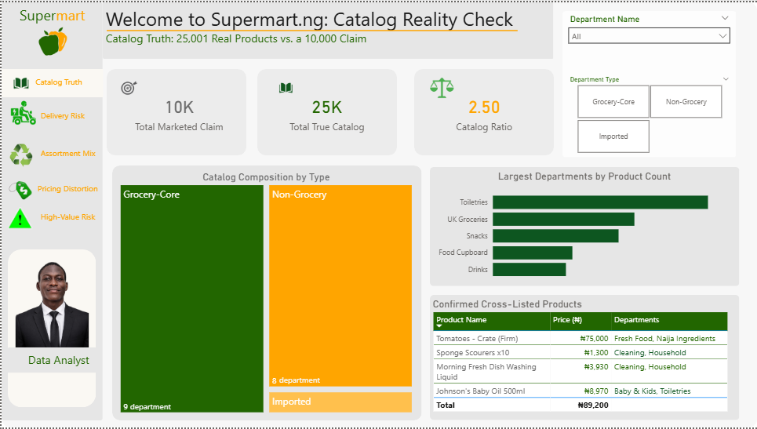
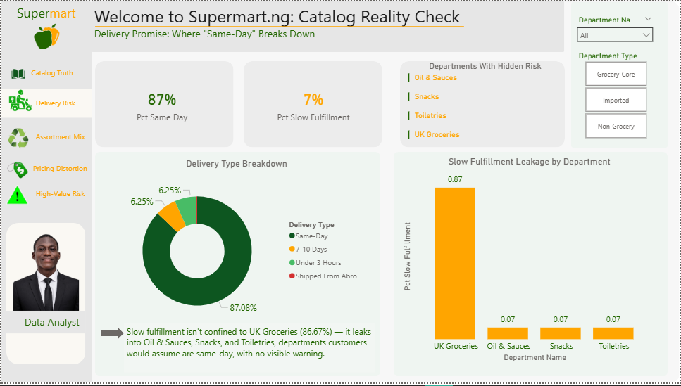
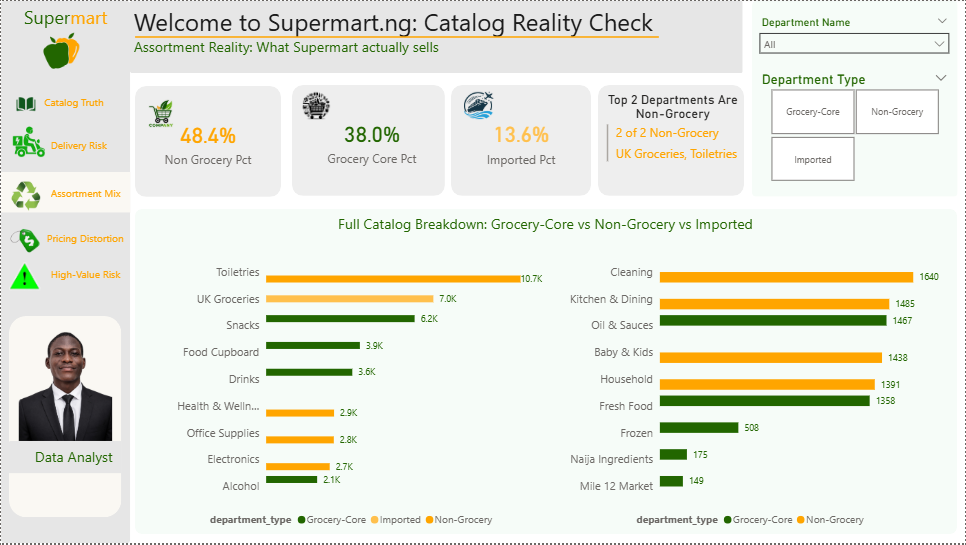
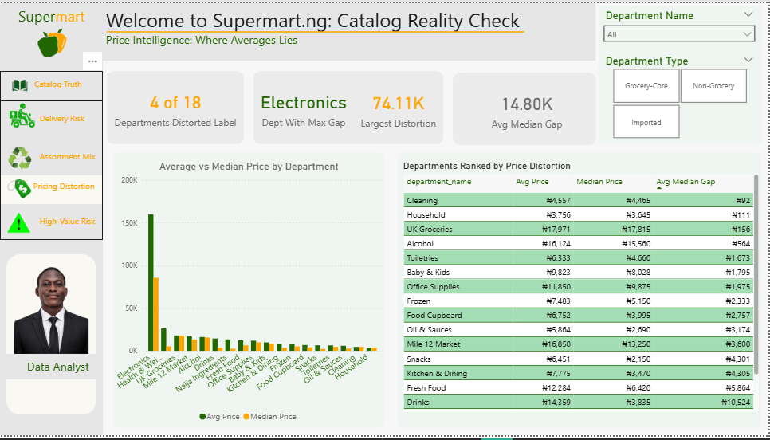
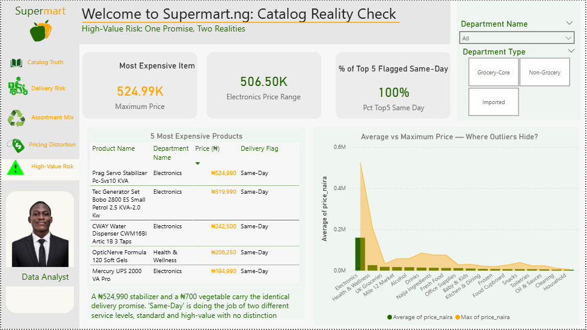

# Supermart.ng: Catalog Reality Check
### An Independent Data Audit of a Live E-Commerce Platform

**By Kehinde Timothy Promise** — Data Analyst
[LinkedIn](https://www.linkedin.com/in/timothy-kehinde-promise-17810529b) · [Portfolio](https://bit.ly/4qIn19W) · timothykehinde06@gmail.com

---

## 📌 Project Summary

Supermart.ng is one of Nigeria's largest online supermarkets. Rather than build a portfolio project on a generic public dataset, I set out to answer a harder question: **does this company's own public data hold up against what it claims about itself?**

Using only information publicly available on their live website — no internal access, no assumptions — I built a full pipeline: real data collection, a PostgreSQL data model, SQL diagnostic queries, and a 5-page interactive Power BI dashboard. The result is five concrete, quantified findings, each independently verifiable by anyone who visits the site.

**This is not a synthetic dataset exercise.** Every number in this project traces back to a live page on supermart.ng at the time of collection.

---

## 🎯 Business Problem

Online grocery platforms operating at scale face a structural risk: as catalog size and department count grow, gaps can quietly open between what marketing communicates, what the site's own architecture reflects, and what customers actually experience. These gaps are often invisible until a customer complaint, an audit, or — as in this case — an outside analyst goes looking.

**The objective:** test whether such inconsistencies exist in Supermart.ng's public catalog, using nothing but the same information a customer or competitor could access, and determine whether the findings represent genuine, non-obvious business risk.

---

## 🧭 Dashboard Overview

The full interactive dashboard is live here: **[View Live Dashboard](https://bit.ly/4qIn19W)**

The dashboard is organized into 5 pages, each answering one core business question. Screenshots below (replace the placeholder paths once uploaded to this repo's `/screenshots` folder).

### Page 1 — Catalog Truth
*Is the catalog what they claim?*



### Page 2 — Delivery Risk
*Is "Same-Day" actually consistent?*



### Page 3 — Assortment Mix
*Is this really a grocery-first platform?*



### Page 4 — Pricing Distortion
*Where do averages lie?*



### Page 5 — High-Value Risk
*What hides inside "Same-Day"?*



---

## 🗂️ Data Source & Methodology

All data was collected directly from the live **supermart.ng** website (August–September 2026). No synthetic, simulated, or assumed data was used at any stage.

**Collection process:**
- Verified the true, de-duplicated catalog size via Shopify's canonical [`/collections/all`](https://www.supermart.ng/collections/all) endpoint → **25,001 unique products**
- Collected real department-level product counts across all **18 published departments**
- Sampled **240 real, individually named products** with live prices, sale flags, and delivery promises across every department
- Cross-referenced department-page totals (51,691) against the true catalog size to quantify a confirmed cross-listing pattern

**Scope & honesty note:** the 240-product sample represents roughly 1% of the true catalog. It's sufficient to *prove that patterns exist* (cross-department duplication, delivery-flag inconsistency, price distortion) — it is not a full census. Every finding below distinguishes between what the sample proves directly and what it reasonably suggests about the full catalog.

---

## 🛠️ Tools Used

| Tool | Purpose |
|---|---|
| **PostgreSQL 18** | Relational data modeling, SQL analysis |
| **pgAdmin** | Query development and validation |
| **Power BI** | Interactive dashboard, DAX measures |
| **Python** | Data verification and pixel-level brand color extraction |

---

## 🗄️ Data Model

Two tables, properly related — not a single flat spreadsheet:

```sql
CREATE TABLE dim_department (
    department_id         SERIAL PRIMARY KEY,
    department_name       VARCHAR(50) UNIQUE NOT NULL,
    category_page_count   INTEGER NOT NULL,
    fulfillment_type       VARCHAR(25) NOT NULL,
    department_type        VARCHAR(30) NOT NULL
);

CREATE TABLE fact_products (
    product_id       SERIAL PRIMARY KEY,
    product_name     VARCHAR(150) NOT NULL,
    department_name  VARCHAR(50) REFERENCES dim_department(department_name),
    price_naira      NUMERIC(10,2) NOT NULL,
    on_sale          BOOLEAN DEFAULT FALSE,
    delivery_flag    VARCHAR(25) DEFAULT 'Same-Day'
);
```

Full SQL scripts, including all 10 diagnostic queries, are in [Business_Problem_(SQL)](./Business_Problem_%28SQL%29)

---

## 🔍 Key Findings

### 1. Catalog Truth — 2.5x Discrepancy
Supermart's homepage advertises **"over 10,000 groceries."** The verified true catalog contains **25,001 unique products** — 2.5x the public claim. Department pages, summed, produce 51,691 listings — roughly double the true catalog — because the average product is tagged into **~2.07 departments simultaneously**. This was confirmed directly: 4 products (e.g., Morning Fresh dish soap, Sponge Scourers) were found listed identically under two different departments at once.

### 2. Delivery Promise Consistency — Hidden Leakage
87.08% of the sample ships **Same-Day**, but slow-fulfillment products (7-10 Days, Shipped From Abroad) appear not just in UK Groceries (expected) but also leak into **Oil & Sauces, Snacks, and Toiletries** — departments a customer would assume are same-day, with no visible warning.

### 3. Assortment Composition — Not Actually Grocery-First
**Non-Grocery departments account for 48.44%** of the entire catalog — the largest share, ahead of Grocery-Core (37.95%). The two single largest departments by product count, **Toiletries and UK Groceries**, are not grocery categories at all — directly contradicting a brand identity built around local grocery delivery.

### 4. Pricing Intelligence — Where Averages Mislead
In at least **4 of 18 departments**, average price is significantly distorted by outliers. Health & Wellness's average (₦26,259) is roughly **5x its median** (₦5,200), driven by a single ₦206,250 item — any report using average price in these categories is materially misleading.

### 5. High-Value Risk Inside "Same-Day"
The 5 most expensive sampled products (up to **₦524,990**) all carry the identical **"Same-Day"** delivery flag as a ₦700 vegetable. "Same-Day" is currently doing the work of two fundamentally different service levels — standard grocery and high-value appliance delivery — with no visible distinction.

---

## 💡 Recommendations

1. **Update public catalog messaging** — the real number (25,001+) is a stronger claim than the current one.
2. **Standardize delivery-flag communication** — flag mixed-fulfillment carts before checkout, regardless of department.
3. **Audit cross-department product tagging** — determine if the ~2.07x tagging rate is intentional or unmanaged.
4. **Reassess non-grocery category depth** — evaluate whether Toiletries/UK Groceries' scale is a deliberate margin strategy or catalog sprawl.
5. **Shift to median-based reporting** for departments with high price dispersion (Electronics, Health & Wellness).
6. **Introduce a high-value handling tier**, separate from standard Same-Day grocery fulfillment.

---

## 📁 Repository Structure

```
├── README.md
├── Business_Problem_(SQL)
│   ├── create_load_tables.sql
│   ├── 01_business_questions.sql
│   ├── 02_business_questions.sql
│   ├── 03_business_questions.sql
│   ├── 04_business_questions.sql
│   └── 05_business_questions.sql
├── /data
│   └── supermart_products_sample.csv
├── Dashboards
│   ├── catalog_truth.png
│   ├── delivery_risk.png
│   ├── assortment_mix.png
│   ├── pricing_distortion.png
│   └── high_value_risk.png
└── Final Report
    └── Supermart_Case_Study.pdf
```

---

## 📎 Full Case Study

A complete written case study — business problem, methodology, all 5 findings with evidence, and recommendations — is available in [`/pdf/Supermart_Case_Study.pdf`](./pdf/Supermart_Case_Study.pdf).

---

## 📬 Contact

**Kehinde Timothy Promise**
Data Analyst | Excel · SQL · PostgreSQL · Power BI

- 📧 timothykehinde06@gmail.com
- 💼 [LinkedIn](https://www.linkedin.com/in/timothy-kehinde-promise-17810529b)
- 💻 [GitHub](https://github.com/kennytee01)
- 📊 [Live Dashboard](https://bit.ly/4qIn19W)
